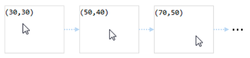

# Elm
Elm is a language for creating web applications that are guaranteed to never crash and have great performance. Elm is a language, so you will not be writing the web's default language JavaScript, but instead a form of Haskell, which is actually quite easy to learn. Having a dedicated language makes the guarantees of high performance and lack of crashes possible.

Elm has gone through a major change very recently. It is therefore important to distinguish between Elm < 0.17 and Elm 0.17 and above. The authors of Elm changed Elm in a fundamental way as they felt that the change would simplify learning Elm, while remaining equally powerful. 

Lets delve straight into what was later removed, but made Elm Functional Reactive Programming.

## Signals (Elm < 0.17)
A signal is a value that changes over time. This abstraction comes straight from [FRP](frp.html#signals). A typical Elm program with signals looks like this:

```haskell
main = lift asText Mouse.position
```

This program continuously outputs the position of the mouse whenever it changes. Compiled and run it looks like this:


<div class="caption">Figure: Basic Elm program, <a href="https://dash.harvard.edu/bitstream/handle/1/12872183/74651384.pdf">source</a></div>

The signals in this application are `Mouse.position` which is a signal of tupled x and y positions, and `lift asTest Mouse.position` which is a new signal made of the first signal and the transformation `asText`. `asText` simply makes the tuples of coordinates into a string like `"(40,100)"`. The function `lift` applies `asText` to every single value inside the `Mouse.position` signal.

| Signal | Type and description |   |
| ------ | ---- | --- |
| `Mouse.position` | `Signal (Int,Int)` | Mouse coordinates |
| `Mouse.clicks` | `Signal ()` | Mouse clicks |
| `Window.dimensions` | `Signal (Int,Int)` | Browser window size |
| `Time.every` | `Time -> Signal Time` | signal firing every `t` ms |
| `Time.fps` | `Float -> Signal Time` | signal firing at a certain fps |
| `Touch.touches` | `Signal [Touch]` | list of touches |
| `Touch.taps` | `Signal { x: Int, y: Int }` | latest tap position |
| `Keyboard.keysDown` | `Signal [KeyCode]` | list of pressed keys |
| `Keyboard.arrows` | `Signal { x: Int, y: Int }` | direction of arrow keys pressed |
| `Keyboard.shift` | `Signal Bool` | whether shift key is pressed |
| `Input.text` | `String -> (Singal Element, Signal String)` | create a text input field |

<div class="caption">Figure: various Elm input signals and signal constructors</div>

There are different ways to deal with multiple signals. To receive the values in two or more signals use 
[`map2`](http://package.elm-lang.org/packages/elm-lang/core/2.1.0/Signal#map2), 
[`map3`](http://package.elm-lang.org/packages/elm-lang/core/2.1.0/Signal#map3), 
[etcetera](http://package.elm-lang.org/packages/elm-lang/core/2.1.0/Signal#map4). 

```haskell
map2
    :  (a -> b -> result)
    -> Signal a
    -> Signal b
    -> Signal result
```

Below example uses `map2` to combine two signals. The ratio takes the latest values of both signals simultaneously.

```haskell
ratio : Int -> Int -> Float
ratio width height =
    toFloat width / toFloat height

aspectRatio : Signal Float
aspectRatio =
    map2 ratio Window.width Window.height
```

If you have two signals that you want to merge into a single signal use [`merge`](http://package.elm-lang.org/packages/elm-lang/core/2.1.0/Signal#merge) or [`mergeMany`](http://package.elm-lang.org/packages/elm-lang/core/2.1.0/Signal#mergeMany):

```haskell
-- Update is a union type: either a mouse move, a time delta or a click
type Update = MouseMove (Int,Int) | TimeDelta Float | Click

updates : Signal Update
updates =
    mergeMany
        [ map MouseMove Mouse.position
        , map TimeDelta (fps 40)
        , map (always Click) Mouse.clicks
        ]
```

A common task is using the value of a signal and the previous value to compute differences or accumulates. Precisely for this there is `foldp` (`p` for past), which is like a standard `Array.fold` but over time. Consider for example click counting. In below sample the `clickCount`-signal starts at 0 and after every click 1 is added to the total.

```haskell
clickCount : Signal Int
clickCount =
    foldp (\click total -> total + 1) 0 Mouse.clicks
```

### Signals of signals
One thing that Elm does explicitly forbid is Signals of Signals. It might be hard to grasp, but an example where other RP libraries use this is for example HTTP requests after some events happens. Another, simpler explainer - courtesy of the creator of Elm - goes like this: 

> If our program has executed for, say 10 minutes, we might create a signal that (through the use of `foldp`) depends on the history of an input signal, say `Window.width`. To compute the current value of this signal, should we use the entire history of `Window.width`? But that would require saving all history of `Window.width` from the beginning of execution, even though we do not know whether the history will be needed later. Alternatively, we could compute the current value of the signal just using the current and new values of `Window.width` (i.e., ignoring the history). But this would allow the possibility of having two identically defined signals that have different values, based on when they were created. We avoid these issues by ruling out signals of signals. 

So there are two ways to implement dynamic signals: 

- storing the full history of signals
- ignore the history and only incorporate new values

The first choice is not an option for performance reasons. Now for the second option:

```haskell
clicks = foldp (\click total -> total + 1) 0 Mouse.clicks

-- after 10 minutes `otherClicks` is defined in your program
otherClicks = foldp (\click total -> total + 1) 0 Mouse.clicks
```

The second is not an option since they want the following to be true for Elm: `clicks` and `otherClicks` contain the same signal value (`foldp (\click total -> total + 1) 0 Mouse.clicks`) thus `clicks` must be exactly the same signal in every case, with equal values, but if `otherClicks` missed the 3 mouse clicks in the first 10 minutes the signal will contain a count of 3 less than `clicks`.

So why does the original [FRP](frp.html) support higher-order signals while Elm can't? In FRP constructors of signals take the start time as a parameter. Therefore `Mouse.clicks t1` can be different than `Mouse.clicks t2` as long as `t1 != t2`. This allows FRP to dynamically create new signals that do not require keeping history while still being pure. The more complicated constructors and the complexity of higher-order streams do not match Elms strive for simplicity however.

### Alternatives to higher order streams
The lack of higher-order signals "does not overly limit the expressiveness" according to the authors of Elm. So how is this possible? Elm has two features that help:

- [`Automaton`](http://package.elm-lang.org/packages/evancz/automaton/latest/Automaton)
- `Task` and `Signal.Mailbox`

Elm contains an implementation of discrete Arrowized FRP (AFRP) to structure stateful programs in the form of `Automaton`. The _signal functions_ of AFRP encapsulate the state and can be safely switched in and out of a program. Basically Automata for submodules of your logic and they can be combined or switched to create larger modules. With higher order signals the inner signals would receive their own specific treatment before they are merged to some output. With Automata all potentially inner signals are just one large signal and the active automata decides which values to forward to which internal Automaton, which to process and which to ignore. 

To give an example, lets write some higher order stream with [Rx](rx.html) and then solve the same problem with an Automaton:

```javascript
let down = Rx.Observable.fromEvent("mousedown")
let move = Rx.Observable.fromEvent("mousemove")
let up = Rx.Observable.fromEvent("mouseup")

function accumulate(state, evt) {
  let x = state.clientX - event.clientX
  let y = state.clientY - event.clientY
  let d = state.d + Math.sqrt(x*x + y*y)
  return { 
    x: evt.clientX, 
    y: evt.clientY, 
    d: d
  }
}

function perDrag(startEvt) {
  return move.scan(accumulate, { 
      x: startEvt.clientX,  
      y: startEvt.clientY, 
      d: 0
    })
    .map(_ => _.d)
    .takeUntil(up)
}

down.flatMap(perDrag).subscribe(d => 
  console.log("distanceDragged", d)
)
```  
Using Elm Automaton:
```haskell
import Mouse exposing (..)
import Automaton exposing (..)
import Signal exposing (map2, map, foldp)
import Graphics.Element exposing (show, Element)

type alias Pair = (Int,Int)
type alias Dist = Int

combinedInputs = map2 (,) Mouse.isDown Mouse.position

dist : Pair -> Pair -> Dist
dist (x1,y1) (x2,y2) =
  let
    dx = toFloat x1 - toFloat x2
    dy = toFloat y1 - toFloat y2
  in 
    round (sqrt (dx * dx + dy * dy))

-- skip first step if supplied -1 for d
measureStep : Pair -> (Dist, Pair) -> (Dist, (Dist, Pair))
measureStep next (d, previous) = 
  let
    sum = (if d < 0 then 0 else d + dist previous next)
  in
    (sum, (sum, next))

measure : Pair -> Automaton Pair Dist
measure initialPos = hiddenState (-1, initialPos) measureStep

ignore : Automaton Pair Dist
ignore = pure (\_ -> 0)

hoMeasure : Automaton (Bool, Pair) Dist
hoMeasure =
  let
    f : (Bool, Pair) 
      -> (Bool, Automaton Pair Dist) 
      -> (Dist, (Bool, Automaton Pair Dist))
    f (down, pos) (pDown, a) =
      if down == pDown then
        (snd (step pos a), (down, fst (step pos a)))
      else if down then
        (0, (down, measure pos))
      else
        (0, (down, ignore))
  in
    hiddenState (False, ignore) f

main = map (\output -> show output) (run hoMeasure 0 combinedInputs)
```

How do these samples compare? While the Rx manages state by creating a stream per drag, the Elm example has a non-higher-order signal `combinedInputs` adding a little more bookkeeping. The Elm sample contains 2 Automata (`measure initialPos` and `hoMeasure`). The `hoMeasure` Automaton is a higher order wrapper around `measure` that resets the total distance upon drag end.

https://github.com/pusher-community/pusher-elm-ports/blob/a93a8fca20265fc900f810eab63b76f53485af4d/App.elm

## Elm 0.17+, alternative to signals
